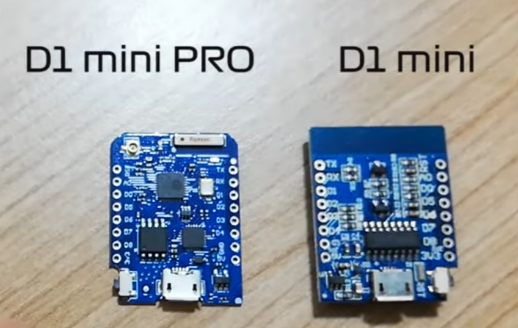

# Wheather station with OLED display

It measures temperature, humidity and presure by using BME280. Displays values on OLED display and sends measurements to MQTT server.

## Parts
1. WeMos D1 Mini with ESP8266

2. OLED display 64x48

3. BME280 sensor

