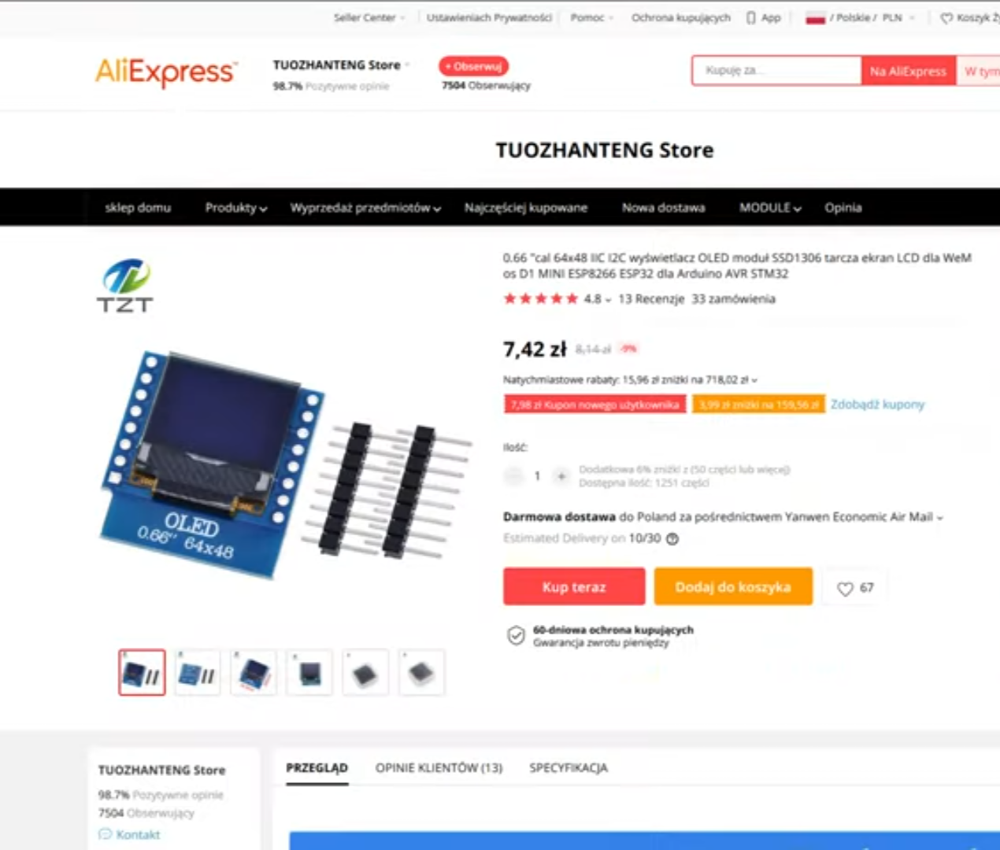
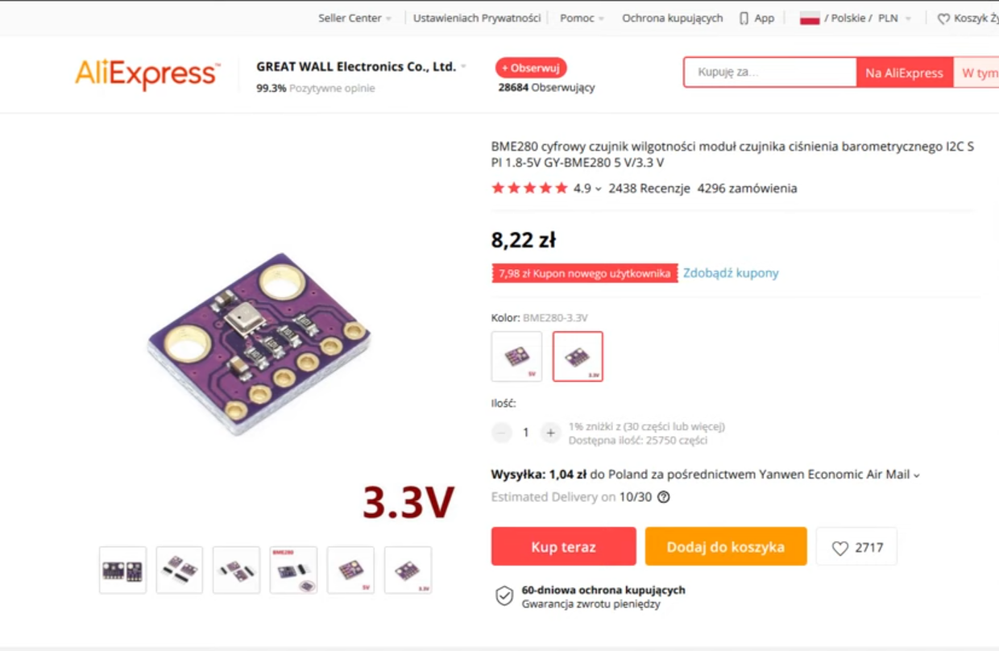
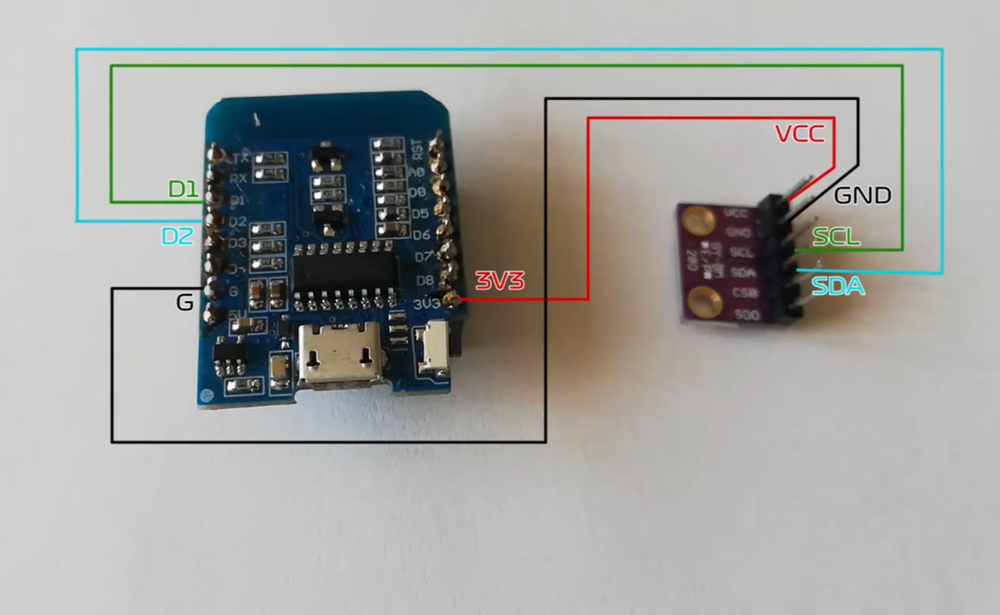

# Wheather station with OLED display

It measures temperature, humidity and presure by using BME280. Displays values on OLED display and sends measurements to MQTT server.

## Parts
1. WeMos D1 Mini with ESP8266

2. OLED display 64x48

3. BME280 sensor

## Connections
OLED display sits on top of WeMos module connected by gold pins sockets.
BME280 is directly soldered to WeMos by wires.

Link to the original project:
[Whather station for 25 PLN](https://youtu.be/UA-aKUzlbEM)
